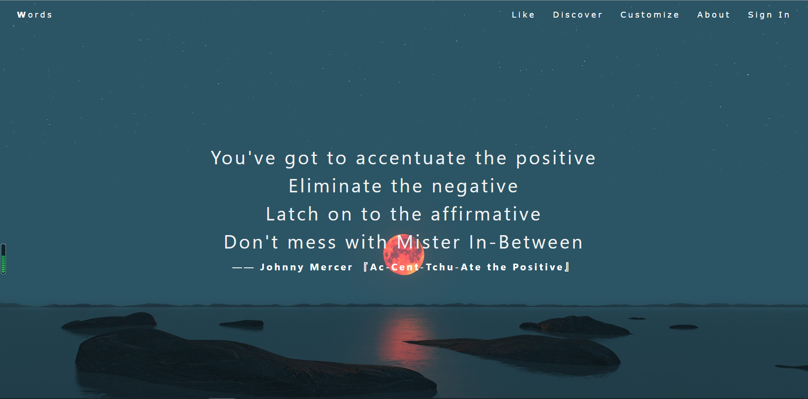

# Words
A text-sharing platform's backend that allows users to share discussions, quotes, stories and like, comment on each other's posts.

Backend built with GraphQL, Node, MongoDB, and Express

Frontend in development using Bootstrap

