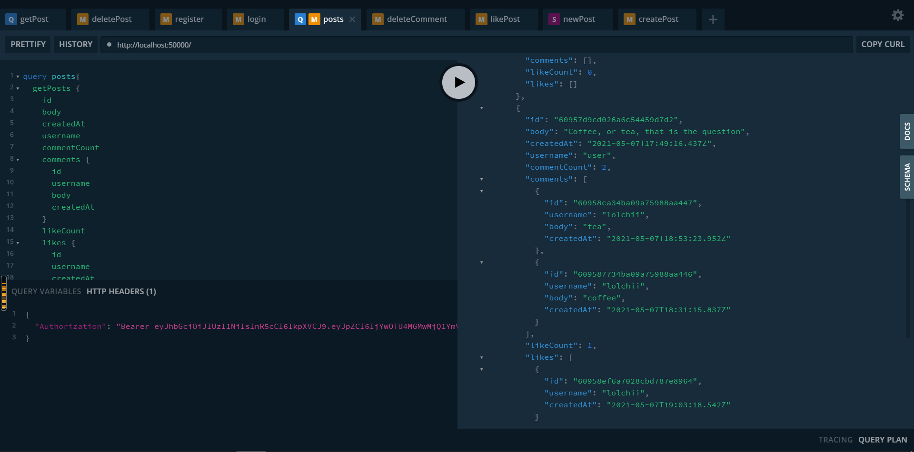
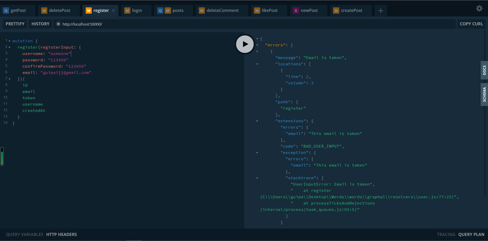
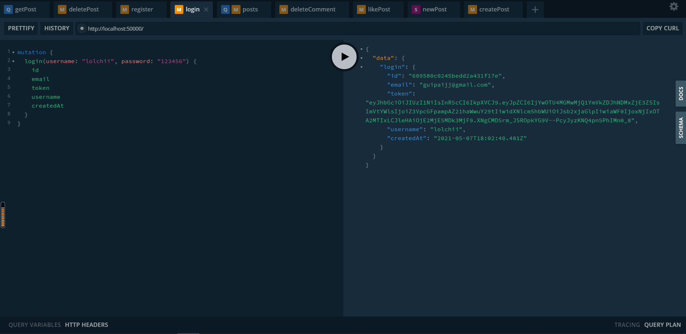
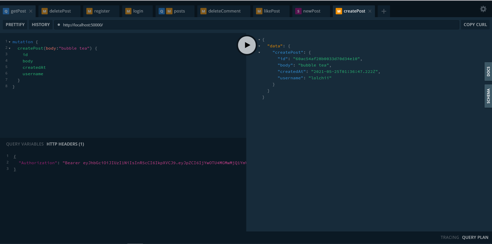
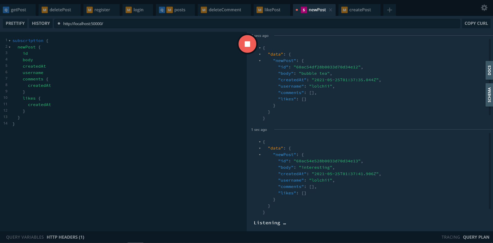

# Words
A text-sharing platform's backend that allows users to share discussions, quotes, stories and like, comment on, subscribe each other's posts.

Backend built with GraphQL, Node, MongoDB, and Express

Frontend in development using Bootstrap

## Frontend Demo:

## Backend Server:
Getting posts data

Registration with validations

Obtaining user data

Creating posts with user authetification token

Subscription notifications system

